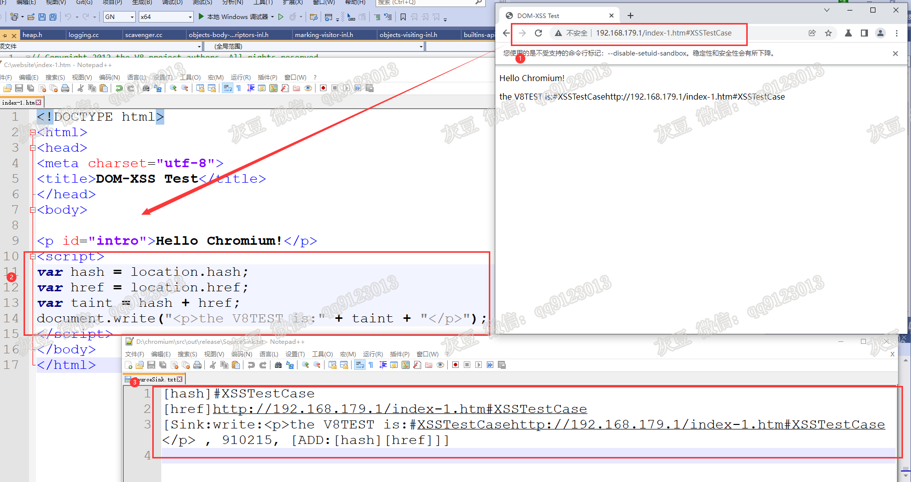

# 基于 Chromium 的 DOM-XSS 自动检测工具  
大家好，我是灰豆。我基于 Chromium 源码实现了 DOM-XSS 检测工具，用于发现可疑的 DOM-XSS。该工具采用动态污染追踪（Taint Tracking）技术，可以监测攻击者可控的输入源（source）与威胁发生点（sink）之间的数据流动过程，为人工验证提供详实可靠的依据。    
软件现处于内测阶段，寻求帮助，**你提供域名、我负责检测、结果归你**  
# 1.征集要求如下：
**1** 建议提供各类 SRC 子域名；   
**2** 子域名必须为活跃域名（200 OK）；  
**3** 子域名格式要求为：http(s)://yourdomain.microsoft.com，域名后面可以有参数；  
**3** 域名来源合法，遵纪守法。
# 2.我的承诺：  
**1** 保密，不把域名分享给其他人，不自私占有检测成果，检测成果归域名提供者所有。  
# 3.软件检测范围  
**（1）** 软件可以检测的输入源（source）如下：  
1.document.baseURI  
2.document.cookie  
3.document.documentURI 
4.document.domain  
5.document.URL  
6.document.referrer  
7.document.textContent  
8.document.title  
9.location.hash   
10.location.hostname    
11.location.href   
12.location.pathname  
13.location.search   
14.element.innerHTML    

**（2）** 可检测的威胁发生点（sink）如下：  
1.document.write()  
2.document.writeln()  
3.setTimeout()  
4.setInterval()  
5.Function()  
6.alert()  
7.eval()    
# 4.软件检测演示图   

图中标记1 是具有 Taint Tracking 技术的 chromium 浏览器；标记2 是测试用例（index-1.htm）源码; 标记 3 是检测结果，下面详细说明检测结果：  
第 1 行，`[hash]#XSSTestCase` 说明被测网页中读取了 location.hash，值为：`#XSSTestCase`;  
第 2 行，`[href]http://192.168.179.1/index-1.htm#XSSTestCase` 说明被测网页中读取了 location.href，值为：`http://192.168.179.1/index-1.htm#XSSTestCase`;  
第 3 行，`[Sink:write:
the V8TEST is:#XSSTestCasehttp://192.168.179.1/index-1.htm#XSSTestCase
 , 910215, [ADD:[hash][href]]]` 这一项采用逗号分隔，说明发现了 source 到 sink 之间的路径。    
其中`Sink:write:
the V8TEST is:#XSSTestCasehttp://192.168.179.1/index-1.htm#XSSTestCase
` 说明检测到了 sink document.write，写入 DOM 的数据内容是 `#XSSTestCasehttp://192.168.179.1/index-1.htm#XSSTestCase
`;  
`910215` 是测试 flag，与结果无关；  
`[ADD:[hash][href]]` 说明了写入 DOM 的数据的来源，ADD表示加法操作，即 hash+href的结果被 document.write 写入 DOM。**注意** 检测结果不包括`
the V8TEST is`，虽然它也与 hash+ href 一同写入 DOM，但它是攻击者不可控的无害数据。

# 5.软件演示视频  
 
知乎视频地址：https://www.zhihu.com/zvideo/1503467439765172224  
# 6.即将在 GitHub 开放 

**软件还在更新中，恳请您提出宝贵意见**
